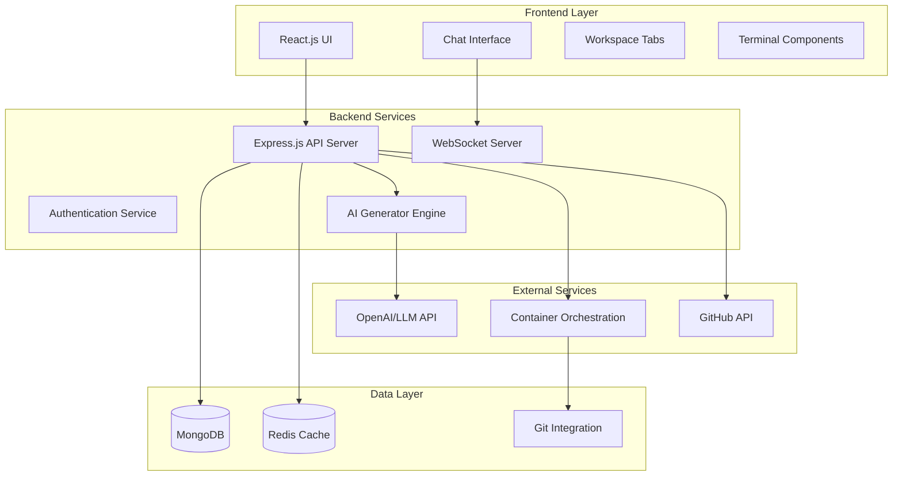

# Design Document

## Overview

BackendForge is designed as a modern web application with a microservices-oriented architecture that leverages AI for intelligent backend code generation. The system follows a split-screen interface pattern with real-time collaboration between users and AI, emphasizing Test-Driven Development (TDD) and comprehensive documentation automation.

The architecture prioritizes modularity, scalability, and security while maintaining a seamless user experience through WebSocket-based real-time updates and containerized preview environments.

## Architecture

### High-Level Architecture



### System Components

#### Frontend Architecture
- **React.js Application**: Single-page application with component-based architecture
- **State Management**: Context API for global state, local state for component-specific data
- **UI Framework**: Tailwind CSS for responsive design and consistent styling
- **Real-time Communication**: Socket.io client for WebSocket connections
- **Specialized Libraries**:
  - React-Chatbot-Kit for chat interface
  - Mermaid.js/ReactFlow for diagram rendering
  - xterm.js for terminal emulation
  - Swagger UI for API documentation display

#### Backend Architecture
- **Express.js Server**: RESTful API with middleware for authentication, validation, and error handling
- **AI Generator Engine**: Core service responsible for code generation and TDD enforcement
- **WebSocket Server**: Real-time communication for live updates and monitoring
- **Authentication Service**: JWT-based authentication with role-based access control
- **Container Orchestration**: Docker integration for preview environments

## Components and Interfaces

### Core Components

#### 1. AI Generator Engine
```typescript
interface AIGeneratorEngine {
  analyzeDescription(description: string): Promise<AnalysisResult>
  generatePlan(analysis: AnalysisResult): Promise<GenerationPlan>
  generateCode(plan: GenerationPlan): Promise<GeneratedProject>
  enforceWorkflow(project: GeneratedProject): Promise<WorkflowResult>
}

interface AnalysisResult {
  techStackRecommendations: TechStack[]
  databaseRecommendations: Database[]
  architectureComponents: Component[]
  clarificationQuestions?: string[]
}

interface GenerationPlan {
  techStack: TechStack
  database: Database
  services: ServiceDefinition[]
  apiEndpoints: EndpointDefinition[]
  testStrategy: TestStrategy
}
```

#### 2. Project Management Service
```typescript
interface ProjectService {
  createProject(userId: string, description: string): Promise<Project>
  updateProject(projectId: string, updates: ProjectUpdate): Promise<Project>
  generateDocumentation(project: Project): Promise<Documentation>
  commitToGit(project: Project, changes: Change[]): Promise<CommitResult>
}

interface Project {
  id: string
  userId: string
  description: string
  techStack: TechStack
  generatedCode: CodeFile[]
  documentation: Documentation
  gitRepoUrl?: string
  status: ProjectStatus
  createdAt: Date
  updatedAt: Date
}
```

#### 3. Real-time Monitoring Service
```typescript
interface MonitoringService {
  startHealthCheck(projectId: string): Promise<HealthStatus>
  runTests(projectId: string, testSuite: string): Promise<TestResults>
  deployPreview(projectId: string): Promise<PreviewEnvironment>
  streamLogs(projectId: string): EventEmitter
}

interface HealthStatus {
  services: ServiceHealth[]
  database: DatabaseHealth
  overall: 'healthy' | 'warning' | 'error'
  lastChecked: Date
}
```

### API Interfaces

#### REST API Endpoints
```typescript
// Project Management
POST /api/projects - Create new project
GET /api/projects/:id - Get project details
PUT /api/projects/:id - Update project
DELETE /api/projects/:id - Delete project

// AI Generation
POST /api/generate/analyze - Analyze description
POST /api/generate/plan - Generate implementation plan
POST /api/generate/code - Generate code
POST /api/generate/fix - AI-powered issue resolution

// Testing and Monitoring
POST /api/test/run - Execute tests
GET /api/health/:projectId - Get health status
POST /api/preview/deploy - Deploy preview environment

// Documentation and Export
GET /api/docs/:projectId - Get project documentation
POST /api/export/openapi - Export OpenAPI specification
POST /api/export/config - Export configuration files
```

#### WebSocket Events
```typescript
// Real-time updates
'project:updated' - Project state changes
'test:results' - Test execution results
'health:status' - Health check updates
'logs:stream' - Live log streaming
'generation:progress' - Code generation progress
'chat:message' - Chat interactions
```

## Data Models

### MongoDB Collections

#### Users Collection
```typescript
interface User {
  _id: ObjectId
  email: string
  passwordHash: string
  preferences: {
    defaultTechStack?: TechStack
    theme: 'light' | 'dark'
    notifications: NotificationSettings
  }
  projects: ObjectId[]
  settings: UserSettings
  createdAt: Date
  lastLoginAt: Date
}
```

#### Projects Collection
```typescript
interface Project {
  _id: ObjectId
  userId: ObjectId
  name: string
  description: string
  techStack: {
    language: string
    framework: string
    database: string
    additionalTools: string[]
  }
  generatedCode: {
    files: CodeFile[]
    structure: DirectoryStructure
  }
  documentation: {
    sections: DocumentationSection[]
    history: ChangeHistory[]
    lastUpdated: Date
  }
  gitIntegration: {
    repoUrl?: string
    branch?: string
    lastCommit?: string
  }
  analytics: {
    generationTime: number
    testCoverage: number
    codeQuality: QualityMetrics
  }
  status: 'planning' | 'generating' | 'completed' | 'error'
  createdAt: Date
  updatedAt: Date
}
```

#### Analytics Collection
```typescript
interface Analytics {
  _id: ObjectId
  anonymizedUserHash: string
  projectType: string
  techStackUsed: TechStack
  generationMetrics: {
    timeToComplete: number
    linesOfCode: number
    testCoverage: number
  }
  userInteractions: {
    chatMessages: number
    aiFixesUsed: number
    manualEdits: number
  }
  timestamp: Date
}
```

### Redis Cache Structure
```typescript
// Session management
'session:{sessionId}' - User session data
'user:{userId}:preferences' - Cached user preferences

// Generation cache
'generation:{projectId}:progress' - Generation progress
'templates:{techStack}' - Cached code templates

// Real-time data
'health:{projectId}' - Latest health status
'logs:{projectId}' - Recent log entries
```

## Error Handling

### Error Classification
1. **User Input Errors**: Invalid descriptions, unsupported tech stacks
2. **AI Generation Errors**: LLM failures, code compilation issues
3. **System Errors**: Database failures, external service outages
4. **Security Errors**: Authentication failures, authorization violations

### Error Handling Strategy
```typescript
interface ErrorHandler {
  handleUserError(error: UserError): UserFriendlyResponse
  handleGenerationError(error: GenerationError): RecoveryAction
  handleSystemError(error: SystemError): SystemResponse
  logError(error: Error, context: ErrorContext): void
}

interface RecoveryAction {
  type: 'retry' | 'fallback' | 'manual_intervention'
  message: string
  suggestedFix?: string
  fallbackTemplate?: CodeTemplate
}
```

### Validation and Security
- Input sanitization for all user-provided data
- OWASP compliance enforcement in generated code
- Rate limiting for AI API calls
- JWT token validation and refresh
- Container isolation for preview environments

## Testing Strategy

### Testing Pyramid

#### Unit Tests
- Component testing for React components
- Service layer testing for backend logic
- AI generator engine testing with mocked LLM responses
- Database model validation testing

#### Integration Tests
- API endpoint testing with real database
- WebSocket communication testing
- Git integration testing
- Container orchestration testing

#### End-to-End Tests
- Complete user workflows from description to generated code
- Multi-user collaboration scenarios
- Error recovery and fallback scenarios
- Performance testing under load

### Test-Driven Development Enforcement
```typescript
interface TDDWorkflow {
  generateTests(requirements: Requirement[]): TestSuite
  implementCode(tests: TestSuite): CodeImplementation
  refactorCode(implementation: CodeImplementation): RefactoredCode
  validateCoverage(code: CodeImplementation, tests: TestSuite): CoverageReport
}
```

### Continuous Testing
- Automated test execution on code changes
- Real-time test result reporting via WebSocket
- Test coverage tracking and reporting
- Performance regression testing

### Quality Assurance
- Code quality metrics (complexity, maintainability)
- Security vulnerability scanning
- Accessibility compliance testing
- Cross-browser compatibility testing